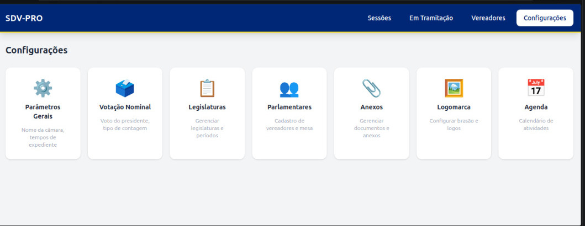

# 🏛️  SISTEMA DE VOTAÇÕES - DGPRO


O SISTEMA DE VOTAÇÕES - DGPRO é uma plataforma completa para gestão e acompanhamento de processos legislativos em câmaras municipais. O sistema permite o controle total de sessões, vereadores e a tramitação de protocolos de forma digital e transparente.

---

## 📸 Screenshots

<div align="center">
  
  <p><i>Interface moderna e intuitiva para gestão legislativa</i></p>
</div>

---

## 🎨 Identidade Visual & UI

O sistema utiliza uma paleta de cores institucional baseada na identidade nacional, garantindo um visual sério e confiável:

- **Azul Brasil** (`#002776`): Utilizado como cor primária em headers, barras de navegação e ações principais.
- **Verde Brasil** (`#009739`): Utilizado para sinalizar sucessos, aprovações e elementos de suporte.
- **Amarelo Brasil** (`#fedd00`): Utilizado para destaques, bordas de foco e detalhes de interface.

### Tecnologia de Estilização
Implementamos o **Tailwind CSS v4**, aproveitando:
- **CSS-First Configuration**: Definição de temas diretamente no `index.css` via bloco `@theme`.
- **Variáveis CSS Nativas**: Integração profunda entre CSS puro e classes utilitárias.
- **Modern Nesting**: Código CSS mais limpo e hierárquico.

---

## 🚀 Tecnologias

Este projeto foi desenvolvido com as seguintes tecnologias:

### Frontend
- [React 19](https://reactjs.org/)
- [TypeScript](https://www.typescriptlang.org/)
- [Vite](https://vitejs.dev/)
- [Tailwind CSS v4](https://tailwindcss.com/)
- [Zustand](https://github.com/pmndrs/zustand) (Gerenciamento de Estado)
- [React Router 7](https://reactrouter.com/)

### Backend
- [Node.js](https://nodejs.org/)
- [Express 5](https://expressjs.com/)
- [MySQL](https://www.mysql.com/)
- [Multer](https://github.com/expressjs/multer) (Upload de arquivos)

---

##  Funcionalidades

- ✅ **Gestão de Sessões**: Abertura, fechamento e cancelamento de sessões legislativas (Ordinárias, Extraordinárias, Solenes).
- ✅ **Cadastro de Vereadores**: Gestão completa de parlamentares, incluindo fotos, partidos e cargos na mesa diretora.
- ✅ **Tramitação de Protocolos**: Acompanhamento de Projetos de Lei, Requerimentos, Moções e Indicações.
- ✅ **Filtro por Exercício**: Organização de dados por ano legislativo.
- ✅ **Interface Responsiva**: Design moderno adaptado para diferentes tamanhos de tela.

---

## 🛠️ Como rodar o projeto

### Pré-requisitos
- Node.js (v18 ou superior)
- MySQL (v8 ou superior)

### Passo a passo

1. **Clone o repositório:**
   ```bash
   git clone https://github.com/DOUGLASWEB-DG/SISTEMA_DIGITAL_DE_VOTA-O-main.git
   cd SISTEMA_DIGITAL_DE_VOTA-O-main
   ```

2. **Configure o Banco de Dados:**
   - Crie um banco de dados chamado `sdvpro`:
     ```sql
     CREATE DATABASE sdvpro;
     ```
   - Importe o schema:
     ```bash
     mysql -u root -p sdvpro < database/schema.sql
     ```

3. **Configure as Variáveis de Ambiente:**
   - No diretório `backend/`, crie um arquivo `.env` baseado no exemplo abaixo:
     ```env
     DB_HOST=localhost
     DB_USER=seu_usuario
     DB_PASSWORD=sua_senha
     DB_NAME=sdvpro
     PORT=3333
     ```

4. **Instale as dependências e inicie:**
   ```bash
   # Instala dependências do frontend e backend
   npm install
   cd backend && npm install && cd ..

   # Para rodar em desenvolvimento:
   # Terminal 1 (Frontend):
   npm run dev

   # Terminal 2 (Backend):
   npm run server
   ```

### 🐳 Rodando com Docker

Se você tem o Docker instalado, pode subir todo o ambiente (Banco + App) com um único comando:

```bash
docker-compose up --build
```

O sistema ficará disponível em `http://localhost:3333`.

---

## 📂 Estrutura do Projeto

```text
.
├── backend/            # Servidor Express, rotas e banco de dados
│   ├── routes/         # Definição das rotas da API
│   ├── uploads/        # Armazenamento de fotos dos vereadores
│   └── server.js       # Ponto de entrada do backend
├── src/                # Código fonte do Frontend (React)
│   ├── components/     # Componentes reutilizáveis
│   ├── pages/          # Páginas da aplicação
│   ├── services/       # Integração com a API (Axios)
│   └── store/          # Gerenciamento de estado (Zustand)
├── database/           # Scripts SQL do banco de dados
└── public/             # Ativos estáticos públicos
```

---

## 📈 Melhorias Futuras

- [ ] Implementar Autenticação JWT para acesso restrito.
- [ ] Migração para **Prisma ORM** e **PostgreSQL**.
- [ ] Conteinerização com **Docker**.
- [ ] Geração de relatórios em PDF.
- [ ] Dashboard com gráficos de votações.

---

## 📝 Licença

Este projeto está sob a licença [ISC](LICENSE).

---

<p align="center">Desenvolvido
 por <a href="https://github.com/DOUGLASWEB-DG">Douglas</a></p>
