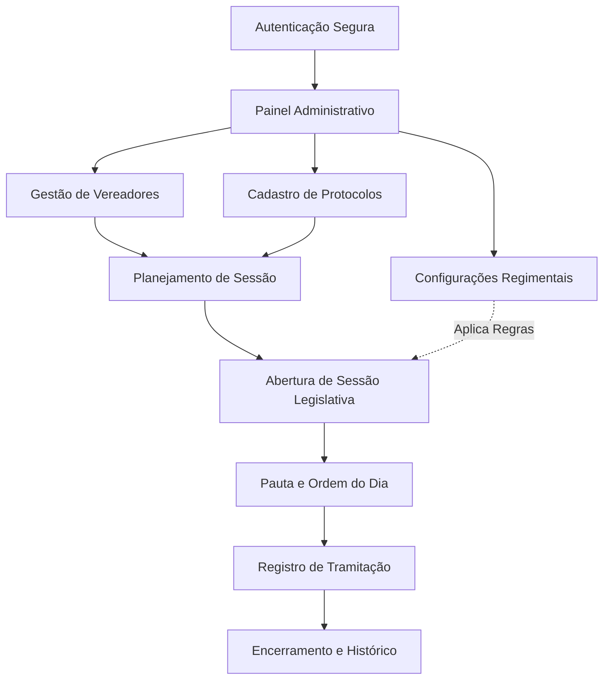

# SDV-PRO | Sistema Digital de Votação Legislativa


> **Solução GovTech para modernização, transparência e automação do processo legislativo municipal.**

---

## 🏛️ Sobre o Projeto

O **SDV-PRO** é uma plataforma Fullstack desenvolvida para transformar a forma como Câmaras Municipais realizam suas sessões de votação. Mais do que um CRUD, o sistema resolve dores críticas da gestão pública: **erros na contagem manual de votos, falta de transparência em tempo real e excesso de burocracia física.**

### 🌟 Problemas Reais que Resolve:
- **Contagem de Votos Auditável:** Automatiza o cálculo de quórum e resultados com base no regimento interno.
- **Transparência Legislativa:** Histórico digital e imediato de como cada parlamentar votou.
- **Economia de Recursos:** Redução drástica de papel com a digitalização de pautas e protocolos.
- **Conformidade com Regimentos:** Configurações flexíveis para o voto da presidência (voto de minerva ou participação plena).

---

## 🚀 Tecnologias Utilizadas

### Frontend
- **React.js + TypeScript:** Interface reativa e tipagem estrita para maior segurança.
- **Tailwind CSS:** Estilização moderna e responsiva.
- **Vite:** Ferramenta de build ultra-rápida.
- **Zustand:** Gerenciamento de estado global leve e eficiente.

### Backend
- **Node.js + Express:** API RESTful robusta e escalável.
- **MySQL:** Banco de dados relacional para garantir a integridade dos dados legislativos.
- **JWT (JSON Web Token):** Autenticação segura de usuários.
- **Bcrypt:** Criptografia de senhas seguindo as melhores práticas de segurança.

### Infraestrutura & Ferramentas
- **Docker & Docker Compose:** Containerização de toda a stack para deploy consistente em qualquer ambiente.
- **Axios:** Integração fluida entre Frontend e API.

---

## 🛠️ Funcionalidades Principais

- [x] **Gestão de Parlamentares:** Cadastro completo com partido e cargos na Mesa Diretora.
- [x] **Controle de Sessões:** Criação de sessões ordinárias e extraordinárias com controle de status (Aberta, Em Andamento, Encerrada).
- [x] **Tramitação de Protocolos:** Gestão de Projetos de Lei, Requerimentos e Indicações com suporte a anexos PDF.
- [x] **Painel de Votação em Tempo Real:** Interface para registro de votos com apuração automática de resultados.
- [x] **Regras de Negócio Customizáveis:** Configuração dinâmica de comportamento de voto para o Presidente da Casa.

---

## 🔄 Fluxo de Funcionamento do Sistema

O SDV-PRO foi projetado para seguir o rito legislativo real, garantindo que cada etapa da sessão seja documentada e configurável.

### Diagrama de Processo


### Detalhamento das Etapas

1. **Gestão de Parlamentares:** Cadastro completo de vereadores, incluindo foto, partido e cargo ocupado na Mesa Diretora (Presidente, Secretário, etc.).
2. **Tramitação de Protocolos:** Registro de Projetos de Lei, Requerimentos e Indicações com definição de **Ementa** e **Rito de Votação** (Maioria Simples, Absoluta ou 2/3).
3. **Configurações Dinâmicas:** Adaptabilidade ao regimento interno, permitindo configurar se o Presidente vota em todas as matérias ou apenas em caso de empate (voto de minerva).
4. **Controle de Sessões:** Criação e gestão de sessões ordinárias e extraordinárias, organizadas por exercício e com controle rigoroso de status.
5. **Histórico e Transparência:** Armazenamento relacional que garante a integridade dos dados para futuras gerações de atas e relatórios de transparência.

---

## 📦 Como Executar o Projeto

### Pré-requisitos
- Docker e Docker Compose instalados.

### Passo a Passo
1. **Clone o repositório:**
   ```bash
   git clone https://github.com/seu-usuario/sistema-digital-de-votacao.git
   cd sistema-digital-de-votacao
   ```

2. **Suba os containers (Banco de Dados):**
   ```bash
   docker compose up -d
   ```

3. **Configure o Backend:**
   ```bash
   cd backend
   npm install
   # Crie seu arquivo .env com as credenciais do banco
   npm start
   ```

4. **Inicie o Frontend:**
   ```bash
   # Em outro terminal, na raiz do projeto
   npm install
   npm run dev
   ```

5. **Dados de Acesso (Default):**
   - **Login:** `admin@sdvpro.com.br`
   - **Senha:** `admin123`

---

## 🧠 Desafios Técnicos Superados
- **Lógica de Proxy no Vite:** Configuração de comunicação entre containers Docker e ambiente de desenvolvimento local.
- **Normalização de Banco de Dados:** Modelagem de dados para suportar as complexas relações entre Vereadores, Sessões e Protocolos.
- **Tratamento de Concorrência:** Garantia de que os votos sejam registrados corretamente durante sessões simultâneas.

---

## 📄 Licença
Este projeto está sob a licença MIT. Veja o arquivo [LICENSE](LICENSE) para mais detalhes.

---
**Desenvolvido com foco em resolver problemas reais e gerar valor para a sociedade.** 🚀
